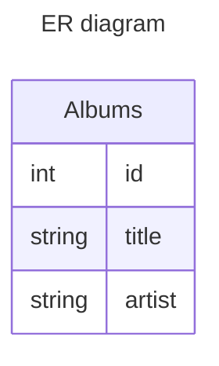

# Example of a REST API with Gin, Gorm & PostgreSQL

This is an example of a rest api following the example in the go tutorial.
With the addition of the usage of Gorm, PostgreSQL & a TOML config file.

This example uses POST, GET, PUT & DELETE http methods

## Routes

### GET
`http://localhost:8080/api/albums`

return all albums

`http://localhost:8080/api/albums/:id`

return the album with the specified id

### POST
`http://localhost:8080/api/albums`

Creates an album with `tite` & `artist` in the body of the request

### PUT
`http://localhost:8080/api/albums/:id`

Edits an album with `tite` & `artist` in the body of the request acording to
the specified id.
If the id is not found the album is created
### DELETE
`http://localhost:8080/api/albums/:id`

Delete an album with the specified id

